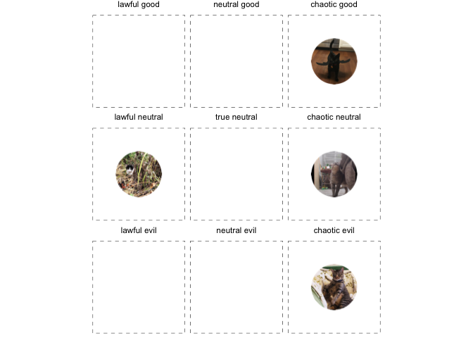

<!-- README.md is generated from README.Rmd. Please edit that file -->

# ggalignment

<!-- badges: start -->

[](https://lifecycle.r-lib.org/articles/stages.html)
[](https://github.com/aftonsteps/ggalignment/actions/workflows/R-CMD-check.yaml)
<!-- badges: end -->

The goal of ggalignment is to do one thing – create DnD-style alignment
charts! These charts range from lawful to neutral to chaotic in one
dimension, and good to neutral to evil in the other. Pictures or text
can be placed in each of boxes to indicate the alignment.

## Installation

You can install the development version from
[GitHub](https://github.com/aftonsteps/ggalignment) with:

``` r
# install.packages("devtools")
devtools::install_github("aftonsteps/ggalignment")
```

You can install the release version from
[CRAN](https://CRAN.R-project.org/package=ggalignment) with:

``` r
install.packages("ggalignment")
```

## Example

This is a basic example which shows you how to use ggalignment:

``` r
library(ggalignment)

# an example dataframe of cats!
align_cats <- example_cats()
```

``` r
ggalignment(align_cats)
```


